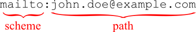

The URI class
=============

In addition to protocol implementations, the :mod:`cpp-netlib`
provides a powerful URI class.  The class implements a parser based
on `RFC 3986`_ and `RFC 2732`_.

Generic URI syntax overview
```````````````````````````

A generic URI will take the form::

  [scheme:]scheme-specific-part[#fragment]

A URI is known as `absolute` if it specifies the scheme.  Otherwise,
it is known as a relative URI.  Currently, ``uri`` supports only
absolute URIs.

URIs can be further classified according to whether they're
hierarchical or opaque (non-hierarchical).

Some examples of non-hierarchical URIs include::

   mailto:john.doe@example.com
   news:comp.infosystems.www.servers.unix
   tel:+1-816-555-1212

The data following the first ``":"`` is said to be opaque to the URI
parser and requires no further parsing.  By way of example, the
following shows how a non-hierarchical URI is processed by the parser
by defining everything after the ``":"`` to be a part of the path:



A hierarchical URI is identified by a double slash (``"//"``) after
the scheme and a scheme-specific component, which `RFC 3986`_ defines
to be::

  [scheme:][//authority][path][?query][#fragment]

The authority component can be further broken down to::

  [user_info@]host[:port]

Examples of hierarchical URIs include::

   http://www.boost.org/
   file:///bin/bash

The following example, describing a complex URI using FTP, shows how
a URI is broken down by the parser:

.. image:: ../_static/ftp_uri.png

Note that the ``authority`` is further subdivided into different
elements.  Another example, using HTTP is given below:

.. image:: ../_static/http_uri.png

The difference here between the path in a hierarchical URI and that in
the example above for the non-hierarchical URI.

The ``uri`` class
`````````````````

As of version 0.9.3, ``uri`` supplies a URI parser and builder.
To use the parser, it's as simple as supplying a string to the
constructor:

.. code-block:: c++

   using namespace boost::network;
   uri::uri instance("http://cpp-netlib.github.com/");
   assert(instance.is_valid());
   std::cout << "scheme: " << instance.scheme() << std::endl
             << "host: " << instance.host() << std::endl;

The command-line output of this program will be::

   scheme: http
   host: cpp-netlib.github.com

The ``uri`` builder
```````````````````

``uri`` support a stream style syntax to create a URI from it's
elements.  For example the program:

.. code-block:: c++

   #include <iostream>
   #include <boost/network/uri.hpp>
   #include <boost/network/uri/uri_io.hpp>
   using namespace boost::network;

   int main() {
       uri::uri url;
       url << uri::scheme("http")
           << uri::host("www.github.com")
           << uri::path("/cpp-netlib");
       std::cout << url << std::endl;
       return 0;
   }

will output::

   http://www.github.com/cpp-netlib

``URI Concept``
```````````````

**Legend**

:U: The URI type.
:u,u_: An instance of **M**.
:S: A string type.
:s,v: An instance of **S**.
:T: The Tag type.

+----------------------------+----------------------+-----------------------------------------+
| Construct                  | Result               | Description                             |
+============================+======================+=========================================+
| ``U(u)``                   | Instance of U        | Copy constructible.                     |
+----------------------------+----------------------+-----------------------------------------+
| ``U(s)``                   | Instance of U        | Constructible from string.              |
+----------------------------+----------------------+-----------------------------------------+
| ``u = u_;``                | Reference to u       | Assignable.                             |
+----------------------------+----------------------+-----------------------------------------+
| ``u = s;``                 | Reference to u       | Assignable from string.                 |
+----------------------------+----------------------+-----------------------------------------+
| ``swap(u, u_);``           | ``void``             | Swappable.                              |
+----------------------------+----------------------+-----------------------------------------+
| ``scheme(u);``             | Convertible to S     | Retrieve the URI scheme of ``u``.       |
+----------------------------+----------------------+-----------------------------------------+
| ``user_info(u);``          | Convertible to S     | Retrieve the user info of ``u``.        |
+----------------------------+----------------------+-----------------------------------------+
| ``host(u);``               | Convertible to S     | Retrieve the host of ``u``.             |
+----------------------------+----------------------+-----------------------------------------+
| ``port(u);``               | Convertible to H     | Retrieve the port of ``u``.             |
+----------------------------+----------------------+-----------------------------------------+
| ``path(u);``               | Convertible to S     | Retrieve the path of ``u``.             |
+----------------------------+----------------------+-----------------------------------------+
| ``query(u);``              | Convertible to S     | Retrieve the query string of ``u``.     |
+----------------------------+----------------------+-----------------------------------------+
| ``fragment(u);``           | Convertible to S     | Retrieve the fragment of ``u``.         |
+----------------------------+----------------------+-----------------------------------------+

.. _`RFC 3986`: http://tools.ietf.org/html/rfc3986
.. _`RFC 2368`: http://tools.ietf.org/html/rfc2368
.. _`RFC 3513`: http://tools.ietf.org/html/rfc3513
.. _`RFC 2732`: http://tools.ietf.org/html/rfc2732
